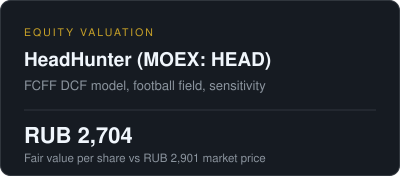
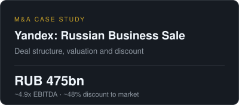
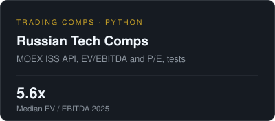

  <a href="https://linkedin.com/in/psmishin">LinkedIn</a> &nbsp;·&nbsp;
  <a href="mailto:p_mishin@hotmail.com">p_mishin@hotmail.com</a>

 

### About

Master of Finance, Higher School of Economics. I work on company valuation, M&A and investment analysis — financial models, deal breakdowns and market data.

Open to roles in M&A, corporate development, investments and strategy.

 

### Selected work

  
  
  

 

### Toolkit

Excel &amp; financial modeling &nbsp;·&nbsp; DCF &amp; trading comps &nbsp;·&nbsp; M&amp;A analysis &nbsp;·&nbsp; Python (data, APIs) &nbsp;·&nbsp; English (B2)

 

Educational projects based on public data. Not investment advice.
